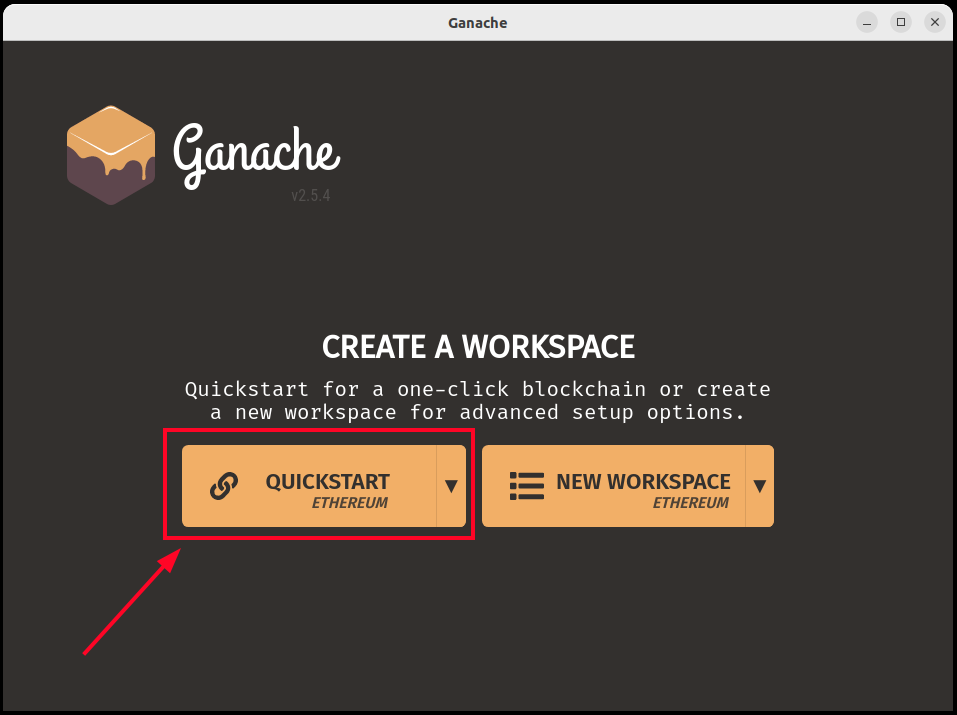
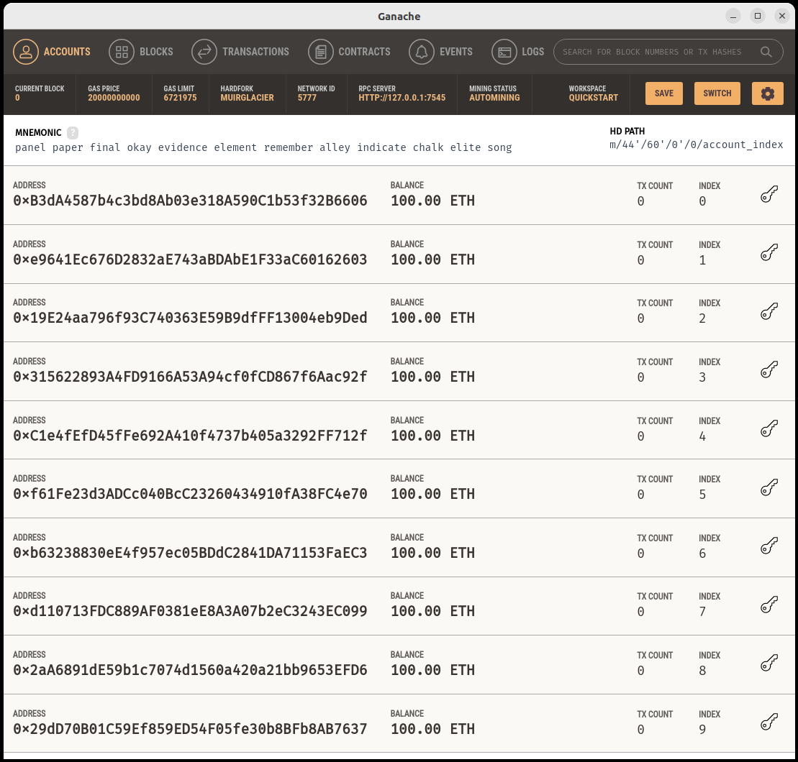
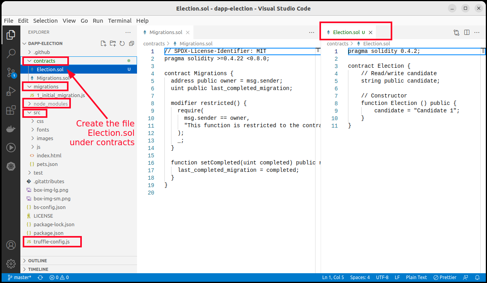

# The ultimate ethereum Dapp tutorial

## Resources

* https://www.dappuniversity.com/articles/the-ultimate-ethereum-dapp-tutorial
* [NodeJS on Ubuntu 22.x guide](https://github.com/nodesource/distributions/blob/master/README.md#debinstall)

## Step 01 - Setup dev env and run initial tests

### 1 - Setup the Ethereum Dapp development environment

__1.1. Install NodeJS and its package manager__ 


```sh
$ curl -fsSL https://deb.nodesource.com/setup_16.x | sudo -E bash -

$ sudo apt-get install -y nodejs

$ node -v
v16.18.1
```

Now, install the package manager and extra libraries that nodejs requires.
The standard NodeJS package manager `npm` has been installed when NodeJS was installed.
```sh
$ npm -v
8.19.2
```

Now, update `npm`.
```sh
// Latest version
$ sudo npm install npm@latest -g

// Sugested version
$ sudo npm install -g npm@9.2.0
```

To install another NodeJS package manager such as `Yarn`, follow the next steps: 
```sh
$ curl -sL https://dl.yarnpkg.com/debian/pubkey.gpg | gpg --dearmor | sudo tee /usr/share/keyrings/yarnkey.gpg >/dev/null
$ echo "deb [signed-by=/usr/share/keyrings/yarnkey.gpg] https://dl.yarnpkg.com/debian stable main" | sudo tee /etc/apt/sources.list.d/yarn.list
$ sudo apt-get update && sudo apt-get install yarn

// Check yarn
$ yarn -v
1.22.19
```

Finally, install the extra libraries:
```sh
$ sudo apt-get install gcc g++ make
```

__1.2. Install Truffle__ 

> It allows us to write smart contacts with the Solidity programming language. It also enables us to test our smart contracts and deploy them to the blockchain. It also gives us a place to develop our client-side application.

```sh
$ sudo npm install -g truffle
```

__1.3. Install Ganache__ 

> It is a local in-memory blockchain. Install Ganache by downloading it from the [Truffle Framework website](https://trufflesuite.com/ganache/). It will give us 10 external accounts with addresses on our local Ethereum blockchain. Each account is preloaded with 100 fake ether.

In my case, I will download [`ganache-2.5.4-linux-x86_64.AppImage`](https://github.com/trufflesuite/ganache-ui/releases/download/v2.5.4/ganache-2.5.4-linux-x86_64.AppImage) file for Linux (Ubuntu 22.04).


__1.4. Install Metamask__ 

> In order to use the blockchain, we must connect to it using a Wallet. The Wallet provides us an ID that allows us to conect to Ethereum Network, perform transactions and interact with our smart contracts. Were goinf to use the Metamask Chrome or Firefox extension.  
> Once installed, we should create an account which will generate an ID to begin operating on the blockchain network.


__1.5. Install a IDE__

> We recommend to install [VSCode](https://code.visualstudio.com/download) and an VSCode's extension wich will allow code NodeJS, TypeScript and Solidity programs.


## 2 - Run a Smoke Test

We are going to check if our Dapp development environment is going to work. In order to do that, we will test it using a simple Dapp. 

__2.1. Open Ganache__

I downloaded [`ganache-2.5.4-linux-x86_64.AppImage`](https://github.com/trufflesuite/ganache-ui/releases/download/v2.5.4/ganache-2.5.4-linux-x86_64.AppImage) installer for Linux in `Dowwnloads/` folder. 

Since it is an `AppImage` file, it will require be installed using `appimagelauncher` (recommended) or different approach.
```sh
$ sudo add-apt-repository ppa:appimagelauncher-team/stable
$ sudo apt -y update
$ sudo apt -y install appimagelauncher
```

Now, go to the downloaded file and double click on it to boot; and you will have a running _local Blockchain_ in your computer. 
You will see Ganache windows asking for `Quickstart` or `New Workspace` options to choose. Click on the first option, you should see this:





__2.2. Create a Project directory for placing the initial dApp__

```sh
$ mkdir dapp-election
$ cd dapp-election
```

__2.3. Create initial dApp using Truffle box with Pet Shop box__

Truffle provides many [examples called boxes](https://trufflesuite.com/boxes/), we will use [Pet Shop box](http://truffleframework.com/boxes/pet-shop) and will reuse its code.
Let's create a dApp from the [Pet Shop box](http://truffleframework.com/boxes/pet-shop) code.

```sh
$ truffle unbox pet-shop
```
You will see this:

```sh
Starting unbox...
=================

✓ Preparing to download box
✓ Downloading
npm WARN old lockfile 
npm WARN old lockfile The package-lock.json file was created with an old version of npm,
npm WARN old lockfile so supplemental metadata must be fetched from the registry.
npm WARN old lockfile 
npm WARN old lockfile This is a one-time fix-up, please be patient...
npm WARN old lockfile 
npm WARN deprecated urix@0.1.0: Please see https://github.com/lydell/urix#deprecated
npm WARN deprecated set-value@2.0.0: Critical bug fixed in v3.0.1, please upgrade to the latest version.
npm WARN deprecated resolve-url@0.2.1: https://github.com/lydell/resolve-url#deprecated
npm WARN deprecated source-map-url@0.4.0: See https://github.com/lydell/source-map-url#deprecated
npm WARN deprecated mixin-deep@1.3.1: Critical bug fixed in v2.0.1, please upgrade to the latest version.
npm WARN deprecated source-map-resolve@0.5.2: See https://github.com/lydell/source-map-resolve#deprecated
npm WARN deprecated chokidar@2.0.4: Chokidar 2 does not receive security updates since 2019. Upgrade to chokidar 3 with 15x fewer dependencies
npm WARN deprecated set-value@0.4.3: Critical bug fixed in v3.0.1, please upgrade to the latest version.
npm WARN deprecated axios@0.17.1: Critical security vulnerability fixed in v0.21.1. For more information, see https://github.com/axios/axios/pull/3410
✓ Cleaning up temporary files
✓ Setting up box

Unbox successful, sweet!

Commands:

  Compile:        truffle compile
  Migrate:        truffle migrate
  Test contracts: truffle test
  Run dev server: npm run dev
```

In the same terminal and same folder `dapp-election`, open the VSCode by executing this command `code .`. This will open VSCode where you can browse the files created with previous command `truffle unbox pet-shop`. You will see this:




__2.4. Add a simple new contract and migrate it__

Add the new simple contract `contracts/Election.sol` with this code in solidity:
```js
pragma solidity >=0.4.22 <0.8.0;

contract Election {
    // Read/write candidate
    string public candidate;

    // Constructor
    constructor () public {
        candidate = "Candidate 1";
    }
}
```

And add the migration script `migrations/2_deploy_contracts.js` to migrate the `contracts/Election.sol`.

```js
var Election = artifacts.require("./Election.sol");

module.exports = function(deployer) {
  deployer.deploy(Election);
};
```

Once create both files, run `truffle migrate` in your terminal, you should see this:

```console
$ truffle migrate

Compiling your contracts...
===========================
> Compiling ./contracts/Election.sol
> Compiling ./contracts/Migrations.sol
> Artifacts written to /home/chilcano/repos/blockchain-workshops/ethereum_dapp_tutorial/dapp-election/build/contracts
> Compiled successfully using:
   - solc: 0.5.16+commit.9c3226ce.Emscripten.clang


Starting migrations...
======================
> Network name:    'development'
> Network id:      5777
> Block gas limit: 6721975 (0x6691b7)


1_initial_migration.js
======================

   Deploying 'Migrations'
   ----------------------
   > transaction hash:    0x85d740794170e95d3e91d4ff096e218f31d951bab955d3c3ef1e60a73704bf0e
   > Blocks: 0            Seconds: 0
   > contract address:    0x6C959b6cACb39be61dc8bF18e813025204345108
   > block number:        1
   > block timestamp:     1674932694
   > account:             0xB3dA4587b4c3bd8Ab03e318A590C1b53f32B6606
   > balance:             99.99616114
   > gas used:            191943 (0x2edc7)
   > gas price:           20 gwei
   > value sent:          0 ETH
   > total cost:          0.00383886 ETH

   > Saving migration to chain.
   > Saving artifacts
   -------------------------------------
   > Total cost:          0.00383886 ETH

Summary
=======
> Total deployments:   1
> Final cost:          0.00383886 ETH
```

If you got this, that means you have migrated successfully your smart contracts.